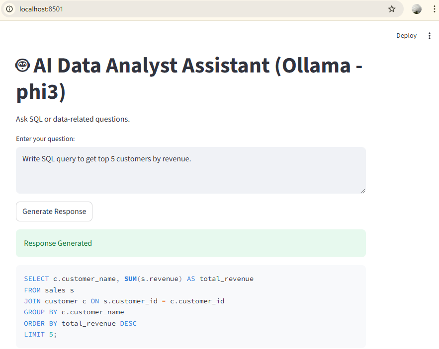

# 🤖 AI Data Analyst Assistant

##  Overview
An AI-powered assistant that helps data analysts:
- Generate optimized SQL queries
- Explain SQL logic
- Suggest business KPIs
- Provide analytical insights

##  Objective
To automate repetitive analytical tasks and assist analysts in faster decision-making using AI.

##  Tech Stack
- Python
- Streamlit
- OpenAI API
- Pandas
- Git & GitHub

##  Features
- Natural language to SQL
- SQL explanation engine
- Insight generation
- Interactive chatbot UI

##  Project Structure
AI-Data-Analyst-Bot/
├── app.py
├── requirements.txt
└── README.md

##  Author
Lakshman Mishra  
Python | SQL | AI | Automation

## 📷 Demo Screenshot

